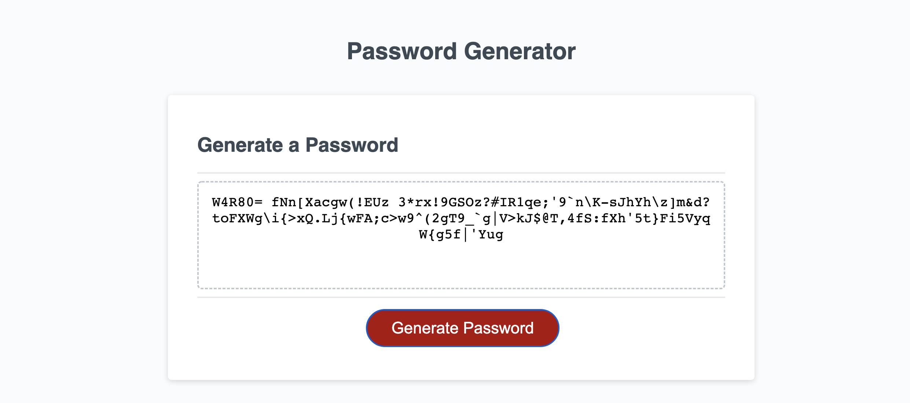

# Password-Generator

## GT Bootcamp - Module 3 Challenge: Password Generator

This challenge was the first big test in the ability to write code in Javascript. We were given source code for a webpage that contained a button for the user to generate a password based on criteria that they chose. The acceptance criteria required the user to choose a password legnth between 8 and 128 characters and asked them which type of characters they wanted to include in the password. After the user inputed these variables, the application was required to produce a randomized password based on those variables.

There were two main stages to developing this application: the first was creating the prompts to accept variables and making sure they worked as expected, the second was writing the code for the application to produce a random string based on those variables.

The first part was relatively straightforward in its structure. I used a prompt fucntion for the password length, and confirm functions for the character choice variables. The biggest challenge with this part of the application was actually screening the password length to make sure the number fit the paramters outlined by the acceptance criteria. I had to construct a series of conditionals so that the user was prompted again if they did not enter a number, or if the number was outside the accepted range.

The second part of the application actually required little code, but it took some time to format correctly. I ended up using a Math.random() and Math.floor() to generate a random integer, and then chose a value from the array of possible characters based on that integer. Finally, I used a for() loop to build a string of these random characters, based on the length provided by the user.

This was actually a very fun exercise, and I learned a lot about how to use the developer tools in Chrome to debug and find out the specific reasons the application wasn't working at each stage of development.

## [Deployed Application](https://mmmphoto.github.io/Password-Generator/)
## [Github Respository](https://github.com/MMMPhoto/Password-Generator)

#### © 2022 Max McDonough
